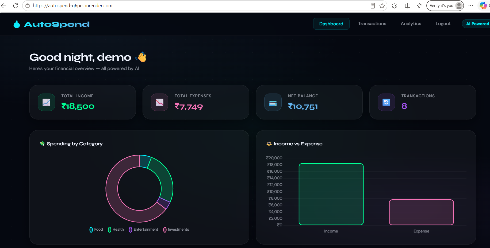
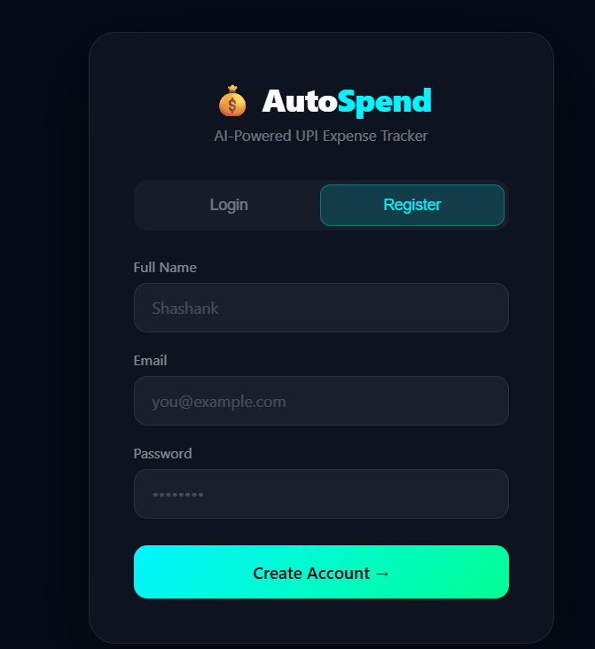

# 💰 AutoSpend — AI-Powered UPI Expense Tracker



> **AutoSpend** is a full-stack AI-powered UPI expense tracker that parses UPI transaction SMS messages and automatically categorizes expenses using Groq LLaMA AI — with a real-time web dashboard, charts, and multi-user support.

🌐 **Live Demo:** [https://autospend-g6pe.onrender.com](https://autospend-g6pe.onrender.com)

---

## ✨ Features

- 🤖 **AI-Powered Categorization** — Groq LLaMA 3.3 auto-categorizes every transaction (Food, Travel, Shopping, Bills, etc.)
- 📱 **UPI SMS Parser** — Paste any UPI SMS and instantly extract transaction details
- 📊 **Real-time Dashboard** — Spending by category (donut chart) + Income vs Expense (bar chart)
- 💳 **Multi-user Support** — Each user sees only their own transactions
- 🔍 **Filters** — Filter by Today, Week, Month + filter by category
- 📤 **CSV Export** — Export all transactions to CSV
- ✏️ **Edit Categories** — Manually update any transaction category
- 🔐 **Auth System** — Register/Login with secure user sessions
- 🛡️ **Keyword Fallback** — Offline categorization when AI is unavailable

---

## 🖥️ Screenshots

### Dashboard


### Transactions


### Login / Register


---

## 🛠️ Tech Stack

| Layer | Technology |
|-------|-----------|
| Backend | Java 22, Spring Boot 3.5 |
| Database | MySQL 8.0 (Aiven Cloud) |
| ORM | Hibernate JPA |
| AI | Groq LLaMA 3.3 70B |
| Frontend | HTML, CSS, JavaScript |
| Charts | Chart.js |
| Containerization | Docker |
| Deployment | Render (Cloud) |
| Version Control | Git + GitHub |

---

## 🏗️ Architecture

```
User (Browser)
      ↓
HTML/CSS/JS Frontend
      ↓
Spring Boot REST APIs
      ↓
    ┌───────────────────┐
    │   Services        │
    │  ┌─────────────┐  │
    │  │ SmsParser   │  │  ← Regex based SMS parsing
    │  │ GeminiSvc   │  │  ← Groq AI categorization
    │  │ Transaction │  │  ← Business logic
    │  │ UserService │  │  ← Auth logic
    │  └─────────────┘  │
    └───────────────────┘
      ↓
MySQL Database (Aiven)
```

---

## 📡 API Endpoints

| Method | URL | Description |
|--------|-----|-------------|
| GET | `/api/hello` | Health check |
| POST | `/api/auth/register` | Register user |
| POST | `/api/auth/login` | Login user |
| POST | `/api/transactions/add` | Add transaction |
| GET | `/api/transactions/user/{userId}` | Get all transactions |
| GET | `/api/transactions/user/{userId}/category/{category}` | Filter by category |
| GET | `/api/transactions/user/{userId}/type/{type}` | Filter by DEBIT/CREDIT |
| PUT | `/api/transactions/{id}/category` | Update category |
| DELETE | `/api/transactions/{id}` | Delete transaction |
| POST | `/api/sms/parse` | Parse UPI SMS |
| GET | `/api/transactions/user/{userId}/export/csv` | Export CSV |

---

## 🚀 How It Works

1. **User pastes a UPI SMS** into the dashboard text box
2. **SmsParser** extracts amount, merchant, type (DEBIT/CREDIT) using Regex
3. **Groq LLaMA AI** categorizes the transaction intelligently
4. If AI fails → **Keyword Fallback** categorizes using merchant name matching
5. Transaction saved to **MySQL** and displayed on dashboard instantly
6. **Charts update** in real time showing spending patterns

---

## 🧪 Sample SMS Messages to Test

```
Rs.250 debited from a/c XX1234 to Zomato UPI Ref:111111111111
Rs.500 debited from a/c XX1234 to Amazon UPI Ref:222222222222
Rs.1200 debited from a/c XX1234 to Uber UPI Ref:333333333333
Rs.15000 credited to a/c XX1234 by Salary UPI Ref:444444444444
Rs.299 debited from a/c XX1234 to Netflix UPI Ref:555555555555
```

---

## ⚙️ Run Locally

### Prerequisites
- Java 22
- Maven
- MySQL 8.0
- Groq API Key (free at [console.groq.com](https://console.groq.com))

### Steps

**1. Clone the repository**
```bash
git clone https://github.com/shashanksh8e/Autospend.git
cd Autospend
```

**2. Create MySQL database**
```sql
CREATE DATABASE autospend_db;
```

**3. Configure application.properties**

Create `src/main/resources/application.properties`:
```properties
spring.datasource.url=jdbc:mysql://localhost:3306/autospend_db
spring.datasource.username=root
spring.datasource.password=your_mysql_password
spring.datasource.driver-class-name=com.mysql.cj.jdbc.Driver
spring.jpa.hibernate.ddl-auto=update
spring.jpa.show-sql=true
spring.jpa.properties.hibernate.dialect=org.hibernate.dialect.MySQL8Dialect
server.port=8081
groq.api.key=your_groq_api_key
```

**4. Run the application**
```bash
./mvnw spring-boot:run
```

**5. Open in browser**
```
http://localhost:8081
```

---

## 🐳 Run with Docker

```bash
# Build image
docker build -t autospend .

# Run container
docker run -p 8081:8081 autospend
```

---

## 📁 Project Structure

```
autospend/
├── src/main/java/com/autospend/
│   ├── AutospendApplication.java
│   ├── controller/
│   │   ├── TransactionController.java
│   │   ├── SmsController.java
│   │   └── UserController.java
│   ├── service/
│   │   ├── TransactionService.java
│   │   ├── GeminiService.java       ← Groq AI integration
│   │   └── UserService.java
│   ├── repository/
│   │   ├── UserRepository.java
│   │   └── TransactionRepository.java
│   ├── model/
│   │   ├── User.java
│   │   └── Transaction.java
│   └── util/
│       └── SmsParser.java           ← Regex SMS parser
├── src/main/resources/
│   └── static/
│       ├── index.html               ← Dashboard
│       └── login.html               ← Auth page
├── Dockerfile
└── pom.xml
```

---

## 🌐 Deployment

App is containerized with **Docker** and deployed on **Render** with:
- **Aiven MySQL** for cloud database
- **Environment variables** for secure config management
- **Auto-deploy** on every GitHub push

---

## 👨‍💻 Author

**Shashank Shetty**
- GitHub: [@shashanksh8e](https://github.com/shashanksh8e)

---

## 📄 License

This project is open source and available under the [MIT License](LICENSE).